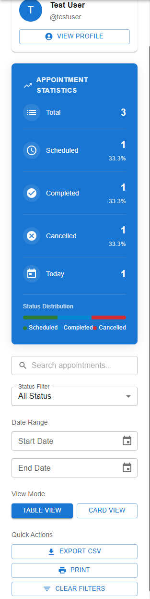
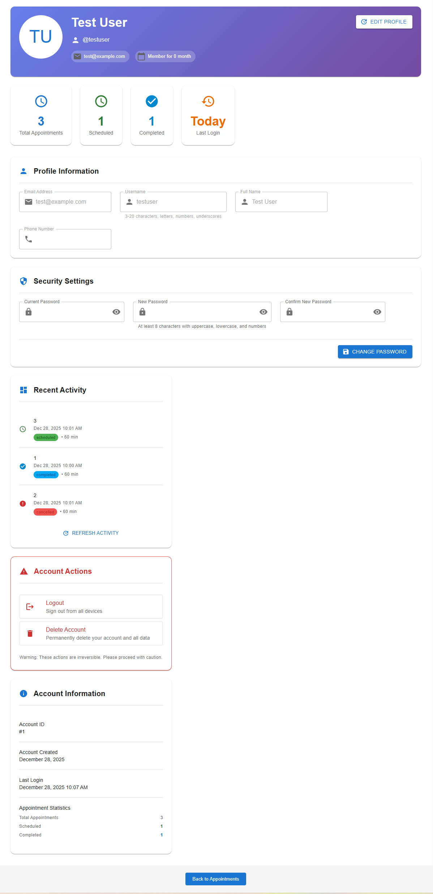
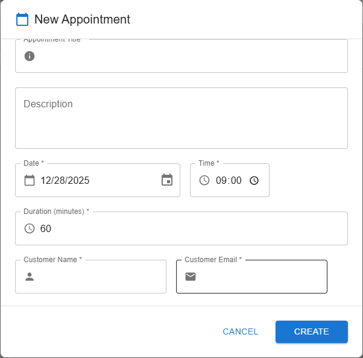
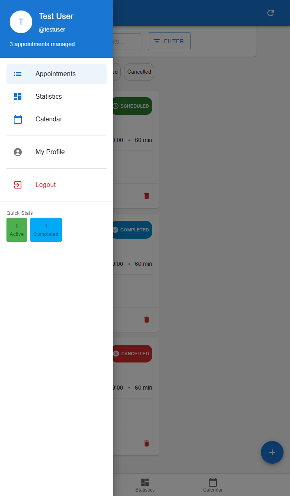
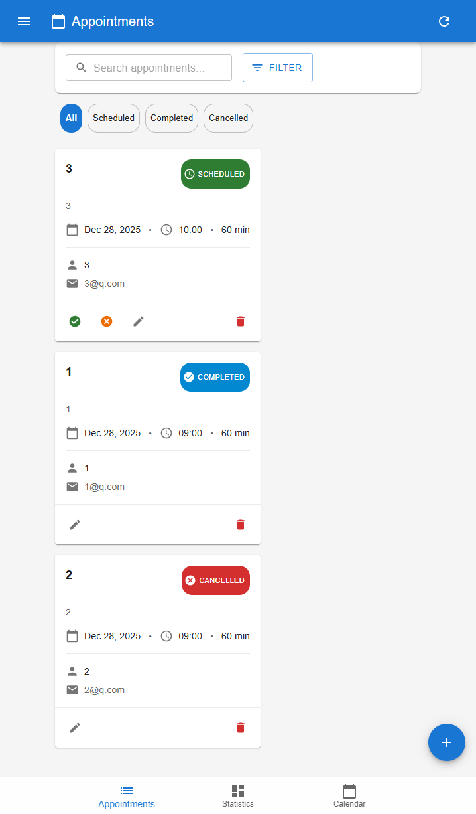
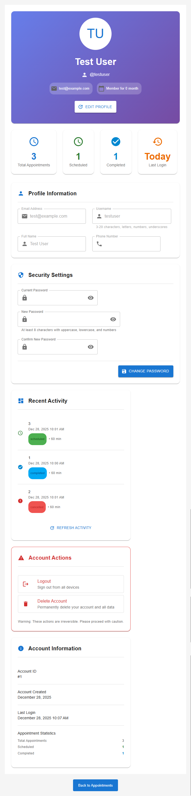
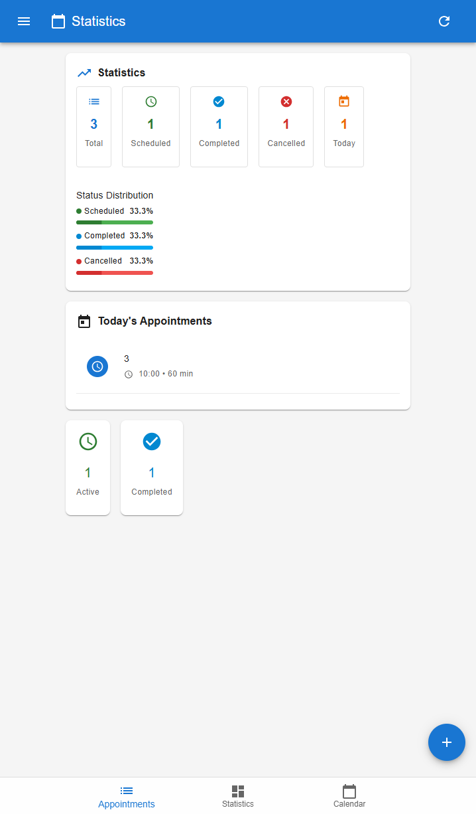
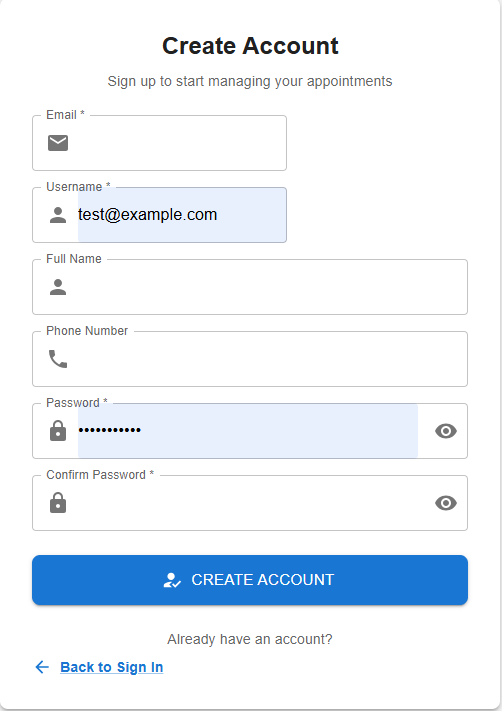

# Appointment Scheduling System with JWT Authentication

## Overview
A modern full-stack web application for appointment management featuring JWT-based authentication, responsive design, and comprehensive user profile management.

## Key Features

### 🔐 **Authentication & Security**
- **JWT-based authentication** with access and refresh tokens
- **Secure password storage** using bcrypt hashing
- **Token auto-refresh** for seamless user experience
- **Session management** with localStorage persistence
- **Demo account** for quick testing (test@example.com / password123)

### 👤 **User Management**
- **User registration** with email and username validation
- **Complete profile management** including avatar display
- **Password change** with strength validation
- **Account information** with creation date and last login
- **User statistics** dashboard

### 📅 **Appointment Management**
- **Create, edit, delete** appointments with validation
- **Appointment status tracking** (scheduled, completed, cancelled)
- **Time conflict detection** to prevent double-booking
- **Bulk operations** for multiple appointments
- **Search and filtering** by multiple criteria
- **Date range selection** with calendar picker

### 📊 **Data Visualization**
- **Real-time statistics** dashboard
- **Status distribution** with progress bars
- **Recent activity** tracking
- **Export functionality** to CSV format
- **Print-ready** views

### 📱 **Responsive Design**
- **Desktop-optimized** interface with sidebar navigation
- **Mobile-friendly** layout with bottom navigation
- **Adaptive components** for different screen sizes
- **Touch-optimized** controls for mobile devices

### 🎯 **Profile Features**
- **Personal information** management
- **Avatar display** with initials
- **Account statistics** overview
- **Activity history** tracking
- **Security settings** management

### 🔧 **Technical Features**
- **JWT authentication** with auto-refresh
- **API interceptors** for automatic token handling
- **Error handling** with user-friendly messages
- **Form validation** on client and server
- **Data persistence** with SQLite database

## Core Components

### Frontend Architecture
- **React.js** with functional components and hooks
- **Material-UI** for consistent design system
- **JWT token management** with axios interceptors
- **Responsive routing** between desktop and mobile views

### Backend Architecture
- **Flask REST API** with JWT authentication
- **SQLAlchemy ORM** for database operations
- **PyJWT** for token generation and validation
- **CORS configuration** with credentials support

## User Experience

### For Appointment Managers
- **Intuitive interface** for scheduling appointments
- **Quick search** and filtering capabilities
- **Bulk actions** for efficient management
- **Export options** for data sharing

### For System Administrators
- **User management** capabilities
- **Activity monitoring** through statistics
- **Security controls** for data protection
- **System health** indicators

## Security Implementation

### Authentication Security
- JWT tokens with expiration times
- Refresh token rotation
- Password strength enforcement
- Input validation on all endpoints

### Data Protection
- User-specific data isolation
- Secure password hashing
- API endpoint protection
- Cross-origin request security

## Development Features

### Code Organization
- **Modular component** structure
- **Shared utilities** for common functions
- **API service layer** with interceptors
- **Error handling** middleware

### Development Tools
- **Hot reload** for rapid development
- **Development proxy** for API calls
- **Debug mode** with detailed errors
- **Console logging** for troubleshooting

## Usage Scenarios

### Small Businesses
- Manage customer appointments
- Track service completion
- Generate activity reports
- Maintain customer records

### Service Providers
- Schedule client meetings
- Manage availability
- Send appointment reminders
- Track service history

### Personal Use
- Manage personal appointments
- Track important events
- Maintain contact information
- Generate personal schedules

## Technology Stack

### Frontend
- React.js 18+
- Material-UI 5+
- Axios for HTTP requests
- Day.js for date manipulation
- JWT for authentication

### Backend
- Python Flask
- SQLAlchemy ORM
- PyJWT 2.8.0+
- Bcrypt for password hashing
- SQLite database

## System Requirements

### Development
- Node.js 16+ for frontend
- Python 3.8+ for backend
- Modern web browser
- Code editor or IDE

### Production
- Web server (Nginx/Apache)
- Database server (SQLite/PostgreSQL)
- SSL certificate for HTTPS
- Domain name configuration

## Deployment

### Backend Deployment
1. Install Python dependencies
2. Configure environment variables
3. Set up database connection
4. Deploy to web server

### Frontend Deployment
1. Build production bundle
2. Configure API endpoints
3. Deploy static files
4. Set up reverse proxy

## Maintenance

### Regular Tasks
- Monitor system logs
- Backup database regularly
- Update dependencies
- Review security settings

### User Support
- Password reset procedures
- Account management assistance
- Technical troubleshooting
- Feature requests handling

## Screenshots

### Desktop Version

### Mobile Version

### Authentication

## Future Enhancements

### Planned Features
- Email notifications
- Calendar synchronization
- Recurring appointments
- File attachments
- Multi-language support
- Advanced reporting
- API documentation
- Mobile app version

### Technical Improvements
- Database migration system
- Unit test coverage
- Performance optimization
- Docker containerization
- CI/CD pipeline
- Load balancing
- Monitoring dashboard
- Analytics integration

---

*This system provides a complete solution for appointment management with modern authentication, responsive design, and comprehensive user management features.*